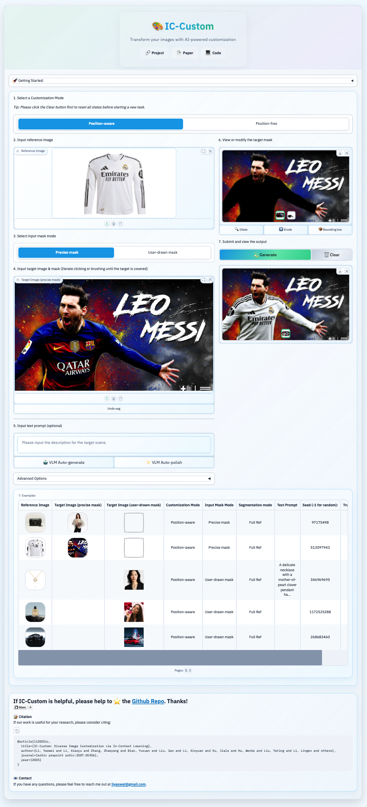

# IC-Custom Application

A sophisticated image customization tool powered by advanced AI models.

> 📺 **App Guide:**  
> For a fast overview of how to use the app, watch this video:  
> [IC-Custom App Usage Guide (YouTube)](https://www.youtube.com/watch?v=uaiZA3H5RV)

---

## 🚀 Quick Start

```bash
python src/app/app.py \
  --config configs/app/app.yaml \
  --hf_token $HF_TOKEN \
  --hf_cache_dir $HF_CACHE_DIR \
  --assets_cache_dir results/app \
  --enable_ben2_for_mask_ref False \
  --enable_vlm_for_prompt False \
  --save_results True
```

---

## ⚙️ Configuration & CLI Arguments

| Argument | Type | Required | Default | Description |
|----------|------|----------|---------|-------------|
| `--config` | str | ✅ | - | Path to app YAML config file |
| `--hf_token` | str | ❌ | - | Hugging Face access token. |
| `--hf_cache_dir` | str | ❌ | `~/.cache/huggingface/hub` | HF assets cache directory |
| `--assets_cache_dir` | str | ❌ | `results/app` | Output images & metadata directory |
| `--save_results` | bool | ❌ | `False` | Save generated results |
| `--enable_ben2_for_mask_ref` | bool | ❌ | `False` | Enable BEN2 background removal |
| `--enable_vlm_for_prompt` | bool | ❌ | `False` | Enable VLM prompt generation |

### Environment Variables

- `HF_TOKEN` ← `--hf_token`
- `HF_HUB_CACHE` ← `--hf_cache_dir`

---

## 📥 Model Downloads

> **Model checkpoints are required before running the app.**  
> All required models will be automatically downloaded when you run the app, or you can manually download them and specify paths in `configs/app/app.yaml`.

### Required Models

The following models are **automatically downloaded** when running the app:

| Model | Purpose | Source |
|-------|---------|--------|
| **IC-Custom** | Our customization model | [TencentARC/IC-Custom](https://huggingface.co/TencentARC/IC-Custom) |
| **CLIP** | Vision-language understanding | [openai/clip-vit-large-patch14](https://huggingface.co/openai/clip-vit-large-patch14) |
| **T5** | Text processing | [google/t5-v1_1-xxl](https://huggingface.co/google/t5-v1_1-xxl) |
| **SigLIP** | Image understanding | [google/siglip-so400m-patch14-384](https://huggingface.co/google/siglip-so400m-patch14-384) |
| **Autoencoder** | Image encoding/decoding | [black-forest-labs/FLUX.1-Fill-dev](https://huggingface.co/black-forest-labs/FLUX.1-Fill-dev/blob/main/ae.safetensors) |
| **DIT** | Diffusion model | [black-forest-labs/FLUX.1-Fill-dev](https://huggingface.co/black-forest-labs/FLUX.1-Fill-dev/blob/main/flux1-fill-dev.safetensors) |
| **Redux** | Image processing | [black-forest-labs/FLUX.1-Redux-dev](https://huggingface.co/black-forest-labs/FLUX.1-Redux-dev) |
| **SAM-vit-h** | Image segmentation | [HCMUE-Research/SAM-vit-h](https://huggingface.co/HCMUE-Research/SAM-vit-h/blob/main/sam_vit_h_4b8939.pth) |

### Optional Models (Selective Download)

**BEN2 and Qwen2.5-VL models are disabled by default** and only downloaded when explicitly enabled:

| Model | Flag | Source | Purpose |
|-------|------|--------|---------|
| **BEN2** | `--enable_ben2_for_mask_ref True` | [PramaLLC/BEN2](https://huggingface.co/PramaLLC/BEN2/blob/main/BEN2_Base.pth) | Background removal |
| **Qwen2.5-VL** | `--enable_vlm_for_prompt True` | [Qwen/Qwen2.5-VL-7B-Instruct](https://huggingface.co/Qwen/Qwen2.5-VL-7B-Instruct) | Prompt generation |

### Manual Configuration

**Alternative**: Manually download all models and specify paths in `configs/app/app.yaml`:

```yaml
checkpoint_config:
  # Required models
  dit_path: "/path/to/flux1-fill-dev.safetensors"
  ae_path: "/path/to/ae.safetensors"
  t5_path: "/path/to/t5-v1_1-xxl"
  clip_path: "/path/to/clip-vit-large-patch14"
  siglip_path: "/path/to/siglip-so400m-patch14-384"
  redux_path: "/path/to/flux1-redux-dev.safetensors"
  # IC-Custom models
  lora_path: "/path/to/dit_lora_0x1561.safetensors"
  img_txt_in_path: "/path/to/dit_txt_img_in_0x1561.safetensors"
  boundary_embeddings_path: "/path/to/dit_boundary_embeddings_0x1561.safetensors"
  task_register_embeddings_path: "/path/to/dit_task_register_embeddings_0x1561.safetensors"
  # APP interactive models
  sam_path: "/path/to/sam_vit_h_4b8939.pth"
  # Optional models
  ben2_path: "/path/to/BEN2_Base.pth"
  vlm_path: "/path/to/Qwen2.5-VL-7B-Instruct"
```

### APP Overview

<p align="center">
  
</p>
